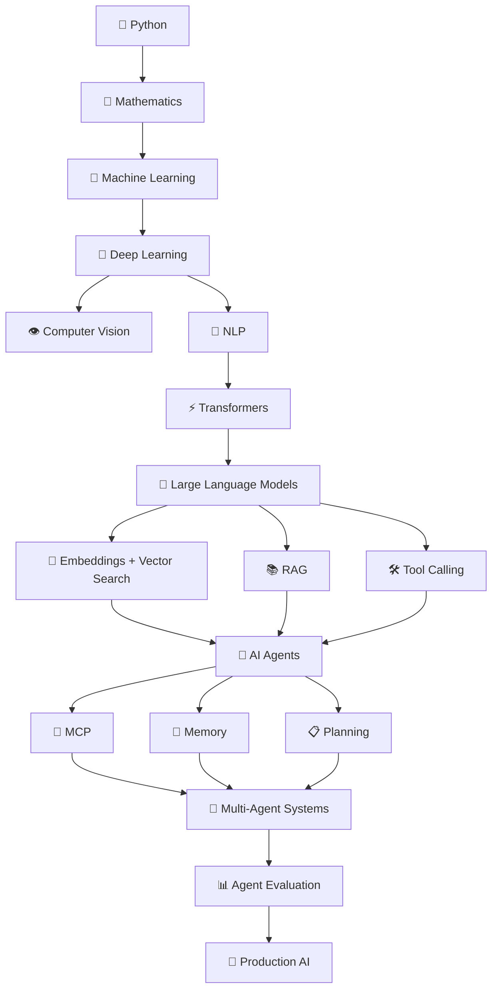
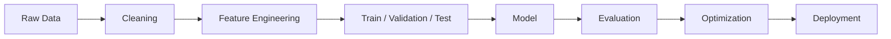
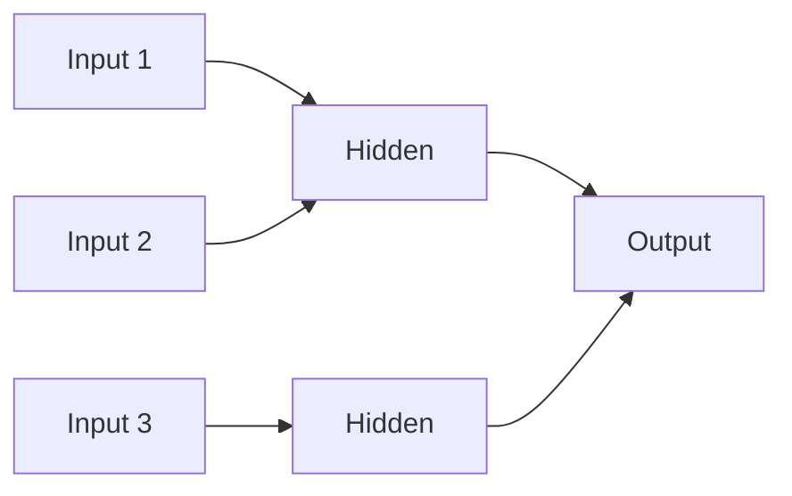
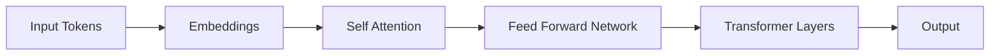
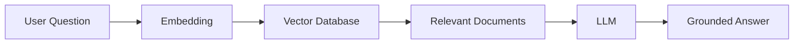
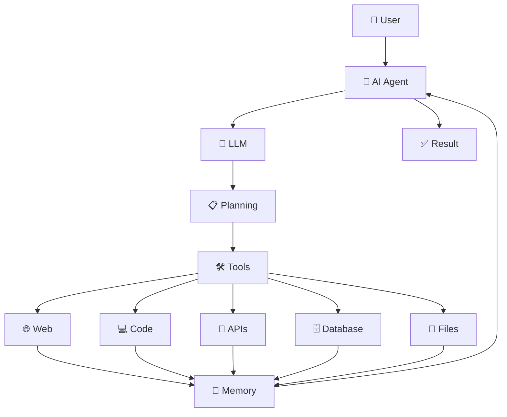
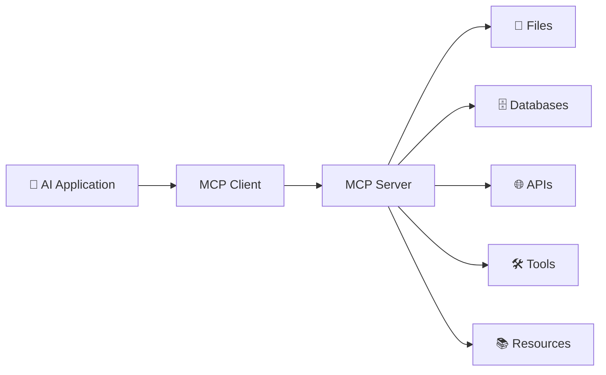
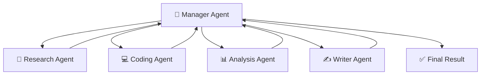
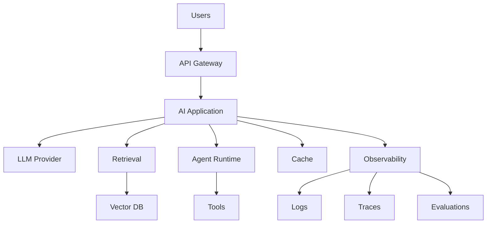

# 🧠 ML Road


<div align="center">

### Machine Learning • Deep Learning • LLMs • Agentic AI

**A practical roadmap from ML fundamentals to production-ready AI agents.**

<br>


<br>

> Learn the theory. Build the systems. Ship the AI.

</div>

---

# 🚀 About ML Road

**ML Road** is my personal learning and engineering roadmap for Artificial Intelligence.

The goal is not to create another huge list of random AI links.

Instead, this repository follows a structured path:

```text
Programming
     ↓
Mathematics
     ↓
Machine Learning
     ↓
Deep Learning
     ↓
Natural Language Processing
     ↓
Transformers
     ↓
Large Language Models
     ↓
RAG + Vector Search
     ↓
Tool-Using AI
     ↓
AI Agents
     ↓
Multi-Agent Systems
     ↓
Production AI Engineering
```

This repository contains:

- 📚 Courses
- 📖 Books
- 📝 Research papers
- 🧪 Experiments
- 💻 ML projects
- 🤖 LLM applications
- 🛠️ AI agent frameworks
- 🔗 MCP resources
- 🧠 Agentic AI research
- 📊 Evaluation techniques
- 🚀 Production AI concepts

---

# 🗺️ AI Engineering Roadmap



---

# 📍 Current Focus

```text
Machine Learning       ████████░░  80%
Deep Learning          ███████░░░  70%
NLP                    ██████░░░░  60%
LLMs                   ███████░░░  70%
RAG                    ██████░░░░  60%
Agentic AI             ████████░░  80%
MCP                    ██████░░░░  60%
Multi-Agent Systems    █████░░░░░  50%
AI Research            █████░░░░░  50%
```

> Progress bars represent learning focus, not certifications or proficiency scores.

---

# 01 — 🐍 Programming Foundations

Before ML, build strong software foundations.

## Python

Important topics:

- Variables
- Functions
- Classes
- OOP
- Iterators
- Generators
- Decorators
- Type hints
- Async programming
- File processing
- APIs
- Testing
- Virtual environments

## Essential Libraries

```text
NumPy
Pandas
Matplotlib
SciPy
Scikit-learn
Jupyter
```

### Goal

Be comfortable transforming raw data into working ML experiments.

---

# 02 — 📐 Mathematics for Machine Learning

Machine learning becomes much easier when the math makes sense.

## Linear Algebra

Learn:

- Vectors
- Matrices
- Matrix multiplication
- Dot products
- Eigenvalues
- Eigenvectors
- Vector spaces
- Matrix decomposition

---

## Calculus

Focus on:

- Derivatives
- Partial derivatives
- Gradients
- Chain rule
- Optimization

---

## Probability

Learn:

- Random variables
- Probability distributions
- Conditional probability
- Bayes' theorem
- Expectation
- Variance

---

## Statistics

Understand:

- Mean / Median / Variance
- Sampling
- Confidence intervals
- Hypothesis testing
- Correlation
- Regression

---

# 03 — 🤖 Machine Learning

## Core Concepts

### Supervised Learning

```text
Data
 ↓
Features
 ↓
Model
 ↓
Prediction
 ↓
Loss
 ↓
Optimization
```

Learn:

- Linear Regression
- Logistic Regression
- Decision Trees
- Random Forest
- Support Vector Machines
- K-Nearest Neighbors
- Gradient Boosting

---

### Unsupervised Learning

Learn:

- K-Means
- Hierarchical clustering
- DBSCAN
- PCA
- Dimensionality reduction
- Anomaly detection

---

## ML Workflow



---

# 🎓 Machine Learning Courses

| Course | Institution | Instructor | Topic |
|---|---|---|---|
| Machine Learning | Coursera | Andrew Ng | ML Fundamentals |
| Machine Learning | Stanford | Andrew Ng | Machine Learning |
| Machine Learning Foundations | NTU | Hsuan-Tien Lin | ML Theory |
| Machine Learning Techniques | NTU | Hsuan-Tien Lin | ML |
| Machine Learning Crash Course | Google | Google | Applied ML |
| Foundations of Machine Learning | NYU | Mehryar Mohri | ML Theory |
| DS1003 Machine Learning | NYU | Julia Kempe / David Rosenberg | ML |

---

# 04 — 🧠 Deep Learning

Deep learning introduces neural networks capable of learning complex representations.

## Core Topics

- Perceptrons
- Neural Networks
- Activation Functions
- Forward Propagation
- Backpropagation
- Gradient Descent
- Loss Functions
- Regularization
- Batch Normalization
- Dropout

---

## Neural Network



---

## Architectures

### CNN

Used heavily for:

- Images
- Object detection
- Computer vision

### RNN / LSTM

Historically important for:

- Sequential data
- Language
- Time series

### Transformers

Modern foundation for:

- LLMs
- NLP
- Vision
- Multimodal AI

---

# 🎓 Deep Learning Courses

| Course | Institution | Topic |
|---|---|---|
| Deep Learning Specialization | DeepLearning.AI | Deep Learning |
| CS231n | Stanford | Computer Vision |
| CS224n | Stanford | NLP |
| CS230 | Stanford | Deep Learning |
| DS-GA 1008 | NYU | Deep Learning |
| Mathematics of Deep Learning | NYU | DL Mathematics |
| Deep Reinforcement Learning | UC Berkeley | RL |
| Dive Into Deep Learning | D2L | Deep Learning |

---

# 05 — 💬 Natural Language Processing

NLP focuses on computers understanding and generating human language.

## Topics

```text
Tokenization
     ↓
Embeddings
     ↓
Neural Language Models
     ↓
Attention
     ↓
Transformers
     ↓
LLMs
```

Learn:

- Tokenization
- Word embeddings
- Word2Vec
- Attention
- Transformers
- Sequence modeling
- Language modeling
- Text classification
- Information retrieval
- Named entity recognition
- Semantic similarity

---

# 06 — ⚡ Transformers

Transformers changed modern AI.

At a simplified level:



Important topics:

- Self-attention
- Query / Key / Value
- Positional encoding
- Multi-head attention
- Encoder
- Decoder
- Context windows
- Tokenization

---

# 07 — 🤯 Large Language Models

Large Language Models power many modern generative AI systems.

## Study

- Pretraining
- Fine-tuning
- Instruction tuning
- RLHF
- Tokenization
- Context windows
- Prompt engineering
- Inference
- Quantization
- Distillation
- Structured outputs
- Function calling

---

# 🔬 LLM Engineering

Knowing how LLMs work is only one part.

Real AI applications require engineering.

```text
User
 ↓
Application
 ↓
Prompt / Context
 ↓
LLM
 ↓
Tools / Retrieval / Memory
 ↓
Validation
 ↓
Response
```

---

# 08 — 🔎 Embeddings

Embeddings represent information as vectors.

Example:

```text
"cat"   → [0.24, -0.81, 0.44, ...]
"dog"   → [0.27, -0.74, 0.40, ...]
"car"   → [-0.63, 0.11, 0.82, ...]
```

Similar concepts tend to appear closer in vector space.

Applications:

- Semantic search
- Recommendation
- RAG
- Clustering
- Classification
- Similarity search

---

# 09 — 📚 Retrieval-Augmented Generation

RAG allows an LLM to retrieve relevant information before generating an answer.



Learn:

- Chunking
- Embeddings
- Vector databases
- Similarity search
- Hybrid search
- Metadata filtering
- Reranking
- Query rewriting
- Context compression
- RAG evaluation

---

# 10 — 🤖 Agentic AI

## What is an AI Agent?

A basic LLM normally follows:

```text
Input → Model → Output
```

An AI agent can operate in a loop:

```text
Goal
 ↓
Reason
 ↓
Plan
 ↓
Choose Tool
 ↓
Take Action
 ↓
Observe Result
 ↓
Update State
 ↓
Continue
 ↓
Final Result
```

---

## Agent Architecture



---

# 🛠️ Agent Capabilities

Modern AI agents can combine:

### 🧠 Reasoning

Understanding the task and determining possible approaches.

### 📋 Planning

Breaking complex goals into smaller steps.

### 🔧 Tool Use

Calling:

- APIs
- Search
- Databases
- Code execution
- Browsers
- Files
- External services

### 🧠 Memory

Keeping useful information across steps.

### 🔄 Iteration

Observing results and adjusting the plan.

### 👤 Human-in-the-loop

Requesting human input when necessary.

---

# 11 — 🧰 Agent Frameworks

## LangChain

Useful for developing LLM-powered applications and integrations.

Topics:

- Models
- Tools
- Retrieval
- Agents
- Structured outputs

---

## LangGraph

Useful for building stateful AI systems.

Study:

- State
- Nodes
- Edges
- Persistence
- Memory
- Human-in-the-loop
- Durable workflows

---

## Strands Agents

Explore:

- Agent loops
- Tools
- Multi-agent architectures
- Tool orchestration

---

# 12 — 🔗 Model Context Protocol

MCP is an important concept in modern agent engineering.

At a high level:



Topics to learn:

- MCP clients
- MCP servers
- Tools
- Resources
- Prompts
- Authentication
- Permissions
- Security

---

# 13 — 🤝 Multi-Agent Systems

Instead of one agent doing everything:



Possible architectures:

- Supervisor + workers
- Router
- Hierarchical agents
- Sequential agents
- Parallel agents
- Debate systems
- Evaluator-optimizer systems

---

# 14 — 🧠 Agent Memory

Agents often need more than the current prompt.

## Short-Term Memory

Current conversation and working context.

## Long-Term Memory

Information retained across interactions.

## Semantic Memory

Facts and knowledge.

## Episodic Memory

Past experiences and actions.

## Procedural Memory

Knowledge about how tasks should be completed.

---

# 15 — 🔨 Tool Use

Tools are one of the most important concepts in agent engineering.

Examples:

```text
search_web()
read_file()
execute_python()
query_database()
send_email()
create_calendar_event()
run_code()
call_api()
```

A strong agent needs to understand:

1. When a tool is needed.
2. Which tool to select.
3. What parameters to provide.
4. How to interpret the result.
5. Whether another action is required.

---

# 16 — 📝 Prompt Engineering

Important concepts:

- System prompts
- User prompts
- Few-shot prompting
- Structured outputs
- Prompt templates
- Context engineering
- Tool descriptions
- Constraints
- Examples
- Output schemas

---

# 17 — 📊 AI Agent Evaluation

Building an agent is only the beginning.

You also need to evaluate it.

## Evaluate

- Task success
- Tool selection
- Tool arguments
- Reasoning reliability
- Hallucination rate
- Retrieval quality
- Latency
- Cost
- Safety
- User satisfaction

Example:

```text
100 Test Tasks

↓
Agent executes each task

↓
Check:
✓ Correct answer?
✓ Correct tool?
✓ Correct action?
✓ Correct citations?
✓ No unnecessary steps?

↓
Calculate success metrics
```

---

# 18 — 🔐 AI Agent Safety

Agents have access to real systems, so safety becomes extremely important.

Study:

- Prompt injection
- Tool permissions
- Sandboxing
- Authentication
- Authorization
- Secret management
- Data leakage
- Human confirmation
- Rate limits
- Audit logs
- Least privilege

---

# 19 — 🚀 Production AI Engineering

Real AI products need more than a model.



Important areas:

- APIs
- Containers
- Docker
- Kubernetes
- Cloud platforms
- CI/CD
- Observability
- Monitoring
- Tracing
- Caching
- Queues
- Databases
- Security
- Cost optimization

---

# 🧪 Projects

Learning becomes much faster when you build.

---

## 🟢 Beginner ML

- [ ] Linear Regression from Scratch
- [ ] Logistic Regression
- [ ] House Price Predictor
- [ ] Spam Classifier
- [ ] Customer Churn Prediction
- [ ] Recommendation System
- [ ] K-Means Visualizer

---

## 🔵 Deep Learning

- [ ] Neural Network from Scratch
- [ ] MNIST Classifier
- [ ] Image Classifier
- [ ] CNN
- [ ] Sentiment Analysis
- [ ] Text Generator

---

## 🟣 LLM Projects

- [ ] LLM Chatbot
- [ ] PDF Chat
- [ ] Semantic Search Engine
- [ ] RAG Application
- [ ] AI Study Assistant
- [ ] LLM Evaluation Pipeline
- [ ] Local LLM App
- [ ] Structured Output Generator

---

## 🟠 Agentic AI Projects

- [ ] Tool-Calling Agent
- [ ] Research Agent
- [ ] Coding Agent
- [ ] Browser Agent
- [ ] SQL Agent
- [ ] RAG Agent
- [ ] GitHub Agent
- [ ] MCP Agent
- [ ] Personal Productivity Agent
- [ ] Multi-Agent Research System
- [ ] Autonomous Debugging Agent
- [ ] Agent Evaluation Framework

---

# 🔥 Advanced Project Ideas

## AI Research Assistant

```text
Question
   ↓
Research Agent
   ↓
Search
   ↓
Read Sources
   ↓
Extract Evidence
   ↓
Compare Sources
   ↓
Generate Report
   ↓
Citations
```

---

## Multi-Agent Software Team

```text
Product Manager
      ↓
Architect Agent
      ↓
Coding Agent
      ↓
Testing Agent
      ↓
Review Agent
      ↓
Final Software
```

---

## Autonomous Data Analyst

```text
Dataset
   ↓
Agent
   ↓
Inspect Data
   ↓
Clean Data
   ↓
Run Analysis
   ↓
Create Charts
   ↓
Explain Findings
```

---

# 📄 Research Papers

## Agentic AI

### ReAct

**ReAct: Synergizing Reasoning and Acting in Language Models**

One of the foundational papers for combining reasoning and actions in language models.

Topics:

- Reasoning
- Acting
- Tool interaction
- Agent loops

---

### Toolformer

**Toolformer: Language Models Can Teach Themselves to Use Tools**

Explores how language models can learn when and how to call external tools.

Topics:

- Tool usage
- APIs
- Language models
- External knowledge

---

# 🔬 Research Areas

Topics I want to explore:

### LLMs

- Reasoning models
- Long-context models
- Fine-tuning
- Model compression
- Multimodal models

### Retrieval

- RAG
- Graph RAG
- Hybrid search
- Reranking
- Retrieval evaluation

### Agents

- Planning
- Memory
- Tool use
- Multi-agent collaboration
- Agent evaluation
- Self-correction
- Long-horizon agents

### Systems

- Distributed inference
- AI infrastructure
- Model serving
- GPU optimization
- LLM observability
- AI reliability

### Human + AI

- Human-in-the-loop
- AI assistants
- AI tutors
- Human-AI collaboration
- AI safety

---

# 📚 Books

## Machine Learning

**Pattern Recognition and Machine Learning**  
Christopher Bishop

**Machine Learning: A Probabilistic Perspective**  
Kevin Murphy

**The Elements of Statistical Learning**  
Trevor Hastie, Robert Tibshirani, Jerome Friedman

**Foundations of Machine Learning**  
Mehryar Mohri

---

## Deep Learning

**Deep Learning**  
Ian Goodfellow, Yoshua Bengio, Aaron Courville

**Deep Learning with Python**  
François Chollet

**Dive into Deep Learning**  
Aston Zhang, Mu Li, Zachary Lipton, Alexander Smola

---

## Artificial Intelligence

**Artificial Intelligence: A Modern Approach**  
Stuart Russell & Peter Norvig

---

## NLP

**Speech and Language Processing**  
Daniel Jurafsky & James Martin

**Natural Language Processing with Python**  
Steven Bird, Ewan Klein & Edward Loper

---

# 🎯 Recommended Learning Order

If you're starting today:

## Phase 1 — Foundations

```text
Python
↓
NumPy
↓
Pandas
↓
Matplotlib
↓
Math
```

---

## Phase 2 — Machine Learning

```text
Scikit-learn
↓
Regression
↓
Classification
↓
Trees
↓
Clustering
↓
Projects
```

---

## Phase 3 — Deep Learning

```text
Neural Networks
↓
PyTorch
↓
CNNs
↓
Attention
↓
Transformers
```

---

## Phase 4 — LLM Engineering

```text
Transformers
↓
LLM APIs
↓
Embeddings
↓
Vector DB
↓
RAG
↓
Evaluation
```

---

## Phase 5 — Agentic AI

```text
Tool Calling
↓
Agent Loops
↓
Memory
↓
Planning
↓
MCP
↓
Agent Evaluation
↓
Multi-Agent Systems
```

---

## Phase 6 — Production

```text
FastAPI
↓
Docker
↓
Cloud
↓
CI/CD
↓
Monitoring
↓
Evaluation
↓
Production AI
```

---

# 🗂️ Suggested Repository Structure

```text
ML-road/
│
├── README.md
│
├── LICENSE
│
│
├── fundamentals/
│   ├── python/
│   ├── mathematics/
│   └── statistics/
│
├── machine-learning/
│   ├── regression/
│   ├── classification/
│   ├── clustering/
│   └── projects/
│
├── deep-learning/
│   ├── neural-networks/
│   ├── cnn/
│   ├── transformers/
│   └── projects/
│
├── llms/
│   ├── prompting/
│   ├── embeddings/
│   ├── rag/
│   └── evals/
│
├── agents/
│   ├── tool-calling/
│   ├── memory/
│   ├── mcp/
│   ├── multi-agent/
│   └── evaluations/
│
├── papers/
│
├── notebooks/
│
├── projects/
│
└── resources/
```

---

# 💻 Tech Stack

<div align="center">


</div>

---

# 📈 Star History

Replace any old Star History embed pointing to another repository with one generated specifically for:

```text
satkynovilgiz/ML-road
```

That way the chart reflects the stars of **this repository**, not the original project.

---

# 🤝 Contributing

Contributions are welcome.

You can contribute:

- New courses
- Research papers
- Books
- AI tools
- Tutorials
- Project ideas
- Agent frameworks
- ML notebooks
- Corrections
- Documentation improvements

### Contribution Flow

```text
Fork
 ↓
Create Branch
 ↓
Make Changes
 ↓
Commit
 ↓
Push
 ↓
Pull Request
```

---

# ⚠️ Disclaimer

This repository is intended for **education and research**.

Copyright belongs to the original authors, publishers, universities, and organizations.

Whenever possible, this repository should link to official resources rather than redistributing copyrighted books or course material.

If you are the copyright holder of material referenced in this repository and believe something should be removed, please open an issue.

---

# 🙏 Credits

This repository builds on and reorganizes resources collected by the broader machine-learning open-source community.

If content or resource lists were adapted from another open-source repository, the original project and its license should be credited clearly.

The goal of **ML Road** is to expand the collection into a modern roadmap covering:

```text
Traditional ML
+
Deep Learning
+
LLMs
+
RAG
+
Agentic AI
+
MCP
+
Multi-Agent Systems
+
Production AI Engineering
```

---

# 👨‍💻 Maintainer

<div align="center">

## Ilgiz Satkynov

**Computer Science • Machine Learning • AI**

Building and learning at the intersection of:

`Software Engineering` • `AI` • `LLMs` • `Agentic Systems`

<br>


</div>

---

<div align="center">

# ⭐ ML Road

### Learn → Build → Experiment → Research → Ship

If this roadmap helps you, consider giving the repository a ⭐.

**More projects and research coming soon.**

</div>
